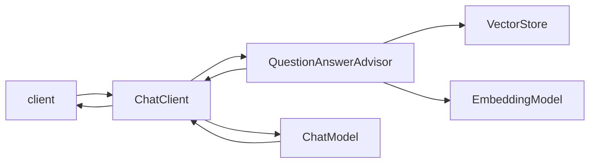

import Photo from '@/components/Photo.astro';

The pitch for spring ai is almost too on-brand for spring: take llm calls, embedding models, vector stores, and the surrounding plumbing, and treat them like every other bean in the container. autowire the chat client, swap providers via configuration, let the rest of the application stay blissfully unaware of which model is actually behind the curtain. i was skeptical for the first week. i'm mostly converted now.

the part that earned my trust isn't the chat client itself — that's a thin wrapper over openai/ollama/bedrock and you could roll it in an afternoon. it's the advisor pipeline. retrieval, prompt rewriting, response post-processing, guardrails: each one is just another `Advisor` you compose in front of `ChatClient.prompt()`. the result is that the same code that talks to gpt-4 in dev talks to a quantized llama in staging without any of the calling code knowing.

## a small example

a rag-flavored call looks roughly like this:

```java
ChatResponse response = chatClient
    .prompt(question)
    .advisors(new QuestionAnswerAdvisor(vectorStore))
    .options(ChatOptions.builder().temperature(0.2).build())
    .call()
    .chatResponse();
```

the `QuestionAnswerAdvisor` does the embed-question / similarity-search / inject-context dance. you can replace it with a custom `Advisor` if you want to do query rewriting first, or stack a `SafetyAdvisor` after it to scrub the response. the spring magic is that none of these care which `EmbeddingModel` or `VectorStore` are wired up — those are switched in `application.yml`.

> the best frameworks aren't the ones that do the most. they're the ones that make the boundary between "their code" and "your code" cheap to cross.

## the request flow

sketching a rag service end-to-end before writing any of it makes the abstractions much easier to swallow:



each box on this diagram is a bean. each arrow is a method call you can break on in a debugger. that is genuinely rare in the llm tooling space, where most of the orchestration lives in vendor sdks or python notebooks that are hard to step through.

## what i'd still avoid

i wouldn't reach for spring ai if you don't already live in the spring ecosystem. the value comes almost entirely from "this fits in next to my existing services" — outside of that, langchain or llamaindex are denser and have more out-of-the-box recipes. but if you're already running spring boot, the cost of adopting it is roughly one starter dependency, and the payoff is being able to swap providers, models, and retrieval strategies without rewriting calling code.

## random photo

<Photo id="a152a662-ff92-4277-b6b0-17ba2cfb40ac" />

