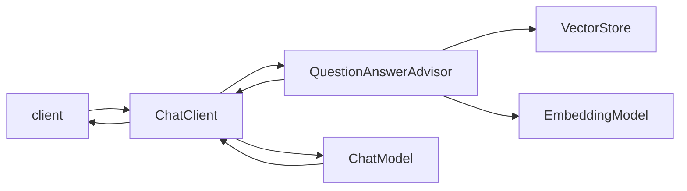

wip

```mermaid
flowchart LR
    A[client] --> B[ChatClient]
    B --> C[QuestionAnswerAdvisor]
    C --> D[VectorStore]
    C --> E[EmbeddingModel]
    C --> B
    B --> F[ChatModel]
    F --> B
    B --> A
```

each box on this diagram is a bean. each arrow is a method call you can break on in a debugger. that is genuinely rare in the llm tooling space, where most of the orchestration lives in vendor sdks or python notebooks that are hard to step through.

